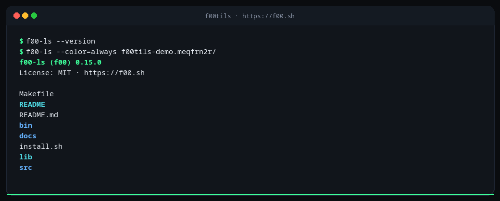
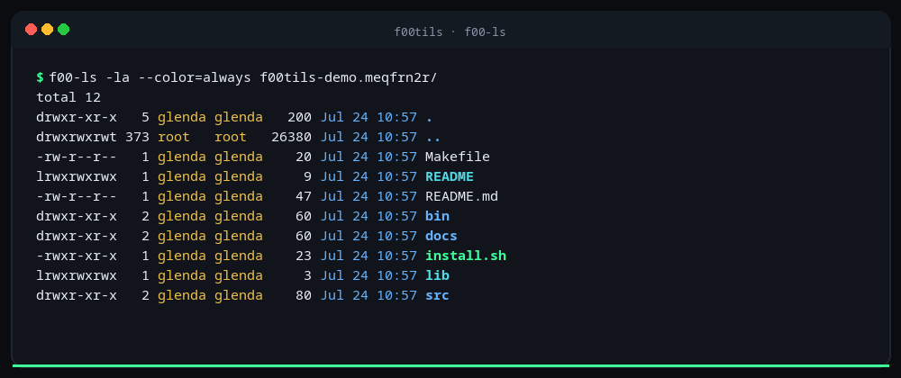
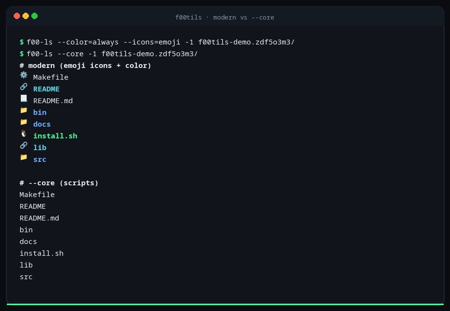
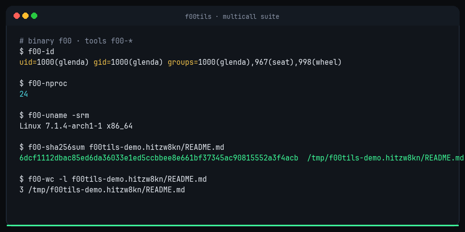

# f00tils

**f00tils** is the freestanding assembly **coreutils** replacement.

Binary name: **`f00`**. Tool names: **`f00-*`**. Joke: coreutils → **f00tils**.

One multicall x86-64 Linux binary (no libc). Modern defaults for interactive work. `--core` for scripts. Faster than coreutils on the measured path. MIT.

| | |
|---|---|
| **Project** | **f00tils** (coreutils replacement suite) |
| **Binary** | `f00` multicall + `f00-*` links + optional short names (`ls`, `cat`, …) |
| **Default** | Modern (color, type gutter, table columns, chromed JSON/CSV) |
| **Icons** | Auto 1-cell ascii (`d`/`l`/`x`/`-`) · glyph/emoji/nerd opt-in · off under `--core` |
| **Scripts** | `--core` — strict coreutils-compatible presentation |
| **Engine** | Pure ASM multicall · ~650K static · no libc |
| **License** | MIT |
| **Status** | Released `v0.15.4` |
| **Site** | [https://f00.sh](https://f00.sh) |
| **Repo** | [github.com/theesfeld/f00](https://github.com/theesfeld/f00) |

```bash
curl -fsSL https://f00.sh/install.sh | bash
```

<p align="center">
  
</p>

<p align="center">
  
</p>

---

## Why it matters

Coreutils are correct and portable. They are not the speed or UX ceiling.

**f00tils** ships the full tool surface as one multicall binary written in freestanding assembly. You keep script-safe behavior under `--core`, and you get modern presentation by default.

---

## Product laws

1. **Clone first.** Every GNU coreutils tool has a `f00-*` counterpart. Under `--core`, flags, inputs, outputs, and exit codes target 1:1 coreutils behavior for scripts.
2. **Modern on top.** Default mode is never a subset of GNU: color on TTY, better layout, `--json` / `--csv` with rich metadata.
3. **Faster always.** Freestanding ASM must beat coreutils on the core path. Slow and correct is not done.
4. **One binary.** Multicall dispatch by `argv0` (`f00-ls`, `ls`, `f00-cat`, …).

---

## Feature parity

| Area | GNU coreutils | **f00tils (ASM)** | uutils | busybox / toybox |
|------|---------------|---------------|--------|------------------|
| All coreutils *names* | Yes | **106/106 scoreboard** | Growing | Subset |
| Script drop-in | Yes | **`--core`** | Flags vary | Reduced |
| Modern default UX | No | **Yes** | Partial | Minimal |
| Suite-wide `--json`/`--csv` | No | **Yes (`f00/v1`)** | Limited | No |
| Pure freestanding ASM | No | **Yes** | No | C |
| Multicall single binary | No* | **Yes** | Optional | Yes |

\*coreutils ships many separate binaries.

### Suite modern surface

| Capability | Default | `--core` |
|------------|---------|----------|
| Color (TTY) | **On** (respects `NO_COLOR`) | Off |
| `--json` | Rich `f00/v1` metadata | Available |
| `--csv` | Same facts, tabular | Available |
| Help | Coreutils flags + modern flags | Same structure |
| Speed | Optimized | **Must beat coreutils** |

---

## Coreutils replacement progress

**Goal: replace every GNU coreutils program.**

<!-- progress: total=106 shipped=106 core_full=106 core_partial=0 core_missing=0 -->
**Progress:** **106/106** tools shipped · **`--core` depth:** 106 full · 0 partial · 0 missing

| Status | Count | Meaning |
|--------|------:|---------|
| shipped | 106/106 | Multicall name exists as `f00-*` |
| `--core` **full** | 106 | Tracked flags match for common cases |
| `--core` partial | 0 | Tool works; some GNU flags still deepening |
| `--core` **missing** | 0 | Not yet in multicall |

Legend — **speed:** `win` = faster than coreutils under `--core`. `—` = not shipped.

| # | coreutils | f00 | shipped | `--core` depth | modern | speed vs GNU |
|--:|:----------|:----|:--------|:---------------|:-------|:-------------|
| 1 | `arch` | `f00-arch` | yes | **full** | yes | win |
| 2 | `b2sum` | `f00-b2sum` | yes | **full** | yes | win |
| 3 | `base32` | `f00-base32` | yes | **full** | yes | win |
| 4 | `base64` | `f00-base64` | yes | **full** | yes | win |
| 5 | `basename` | `f00-basename` | yes | **full** | yes | win |
| 6 | `basenc` | `f00-basenc` | yes | **full** | yes | win |
| 7 | `cat` | `f00-cat` | yes | **full** | deep | win |
| 8 | `chcon` | `f00-chcon` | yes | **full** | yes | win |
| 9 | `chgrp` | `f00-chgrp` | yes | **full** | yes | win |
| 10 | `chmod` | `f00-chmod` | yes | **full** | yes | win |
| 11 | `chown` | `f00-chown` | yes | **full** | yes | win |
| 12 | `chroot` | `f00-chroot` | yes | **full** | yes | win |
| 13 | `cksum` | `f00-cksum` | yes | **full** | yes | win |
| 14 | `comm` | `f00-comm` | yes | **full** | yes | win |
| 15 | `cp` | `f00-cp` | yes | **full** | yes | win |
| 16 | `csplit` | `f00-csplit` | yes | **full** | yes | win |
| 17 | `cut` | `f00-cut` | yes | **full** | yes | win |
| 18 | `date` | `f00-date` | yes | **full** | yes | win |
| 19 | `dd` | `f00-dd` | yes | **full** | yes | win |
| 20 | `df` | `f00-df` | yes | **full** | yes | win |
| 21 | `dir` | `f00-dir` | yes | **full** | yes | win |
| 22 | `dircolors` | `f00-dircolors` | yes | **full** | yes | win |
| 23 | `dirname` | `f00-dirname` | yes | **full** | yes | win |
| 24 | `du` | `f00-du` | yes | **full** | yes | win |
| 25 | `echo` | `f00-echo` | yes | **full** | yes | win |
| 26 | `env` | `f00-env` | yes | **full** | yes | win |
| 27 | `expand` | `f00-expand` | yes | **full** | yes | win |
| 28 | `expr` | `f00-expr` | yes | **full** | yes | win |
| 29 | `factor` | `f00-factor` | yes | **full** | yes | win |
| 30 | `false` | `f00-false` | yes | **full** | yes | win |
| 31 | `fmt` | `f00-fmt` | yes | **full** | yes | win |
| 32 | `fold` | `f00-fold` | yes | **full** | yes | win |
| 33 | `groups` | `f00-groups` | yes | **full** | yes | win |
| 34 | `head` | `f00-head` | yes | **full** | yes | win |
| 35 | `hostid` | `f00-hostid` | yes | **full** | yes | win |
| 36 | `id` | `f00-id` | yes | **full** | yes | win |
| 37 | `install` | `f00-install` | yes | **full** | yes | win |
| 38 | `join` | `f00-join` | yes | **full** | yes | win |
| 39 | `link` | `f00-link` | yes | **full** | yes | win |
| 40 | `ln` | `f00-ln` | yes | **full** | yes | win |
| 41 | `logname` | `f00-logname` | yes | **full** | yes | win |
| 42 | `ls` | `f00-ls` | yes | **full** | deep | win |
| 43 | `md5sum` | `f00-md5sum` | yes | **full** | yes | win |
| 44 | `mkdir` | `f00-mkdir` | yes | **full** | yes | win |
| 45 | `mkfifo` | `f00-mkfifo` | yes | **full** | yes | win |
| 46 | `mknod` | `f00-mknod` | yes | **full** | yes | win |
| 47 | `mktemp` | `f00-mktemp` | yes | **full** | yes | win |
| 48 | `mv` | `f00-mv` | yes | **full** | yes | win |
| 49 | `nice` | `f00-nice` | yes | **full** | yes | win |
| 50 | `nl` | `f00-nl` | yes | **full** | yes | win |
| 51 | `nohup` | `f00-nohup` | yes | **full** | yes | win |
| 52 | `nproc` | `f00-nproc` | yes | **full** | yes | win |
| 53 | `numfmt` | `f00-numfmt` | yes | **full** | yes | win |
| 54 | `od` | `f00-od` | yes | **full** | yes | win |
| 55 | `paste` | `f00-paste` | yes | **full** | yes | win |
| 56 | `pathchk` | `f00-pathchk` | yes | **full** | yes | win |
| 57 | `pinky` | `f00-pinky` | yes | **full** | yes | win |
| 58 | `pr` | `f00-pr` | yes | **full** | yes | win |
| 59 | `printenv` | `f00-printenv` | yes | **full** | yes | win |
| 60 | `printf` | `f00-printf` | yes | **full** | yes | win |
| 61 | `ptx` | `f00-ptx` | yes | **full** | yes | win |
| 62 | `pwd` | `f00-pwd` | yes | **full** | yes | win |
| 63 | `readlink` | `f00-readlink` | yes | **full** | yes | win |
| 64 | `realpath` | `f00-realpath` | yes | **full** | yes | win |
| 65 | `rm` | `f00-rm` | yes | **full** | yes | win |
| 66 | `rmdir` | `f00-rmdir` | yes | **full** | yes | win |
| 67 | `runcon` | `f00-runcon` | yes | **full** | yes | win |
| 68 | `seq` | `f00-seq` | yes | **full** | yes | win |
| 69 | `sha1sum` | `f00-sha1sum` | yes | **full** | yes | win |
| 70 | `sha224sum` | `f00-sha224sum` | yes | **full** | yes | win |
| 71 | `sha256sum` | `f00-sha256sum` | yes | **full** | yes | win |
| 72 | `sha384sum` | `f00-sha384sum` | yes | **full** | yes | win |
| 73 | `sha512sum` | `f00-sha512sum` | yes | **full** | yes | win |
| 74 | `shred` | `f00-shred` | yes | **full** | yes | win |
| 75 | `shuf` | `f00-shuf` | yes | **full** | yes | win |
| 76 | `sleep` | `f00-sleep` | yes | **full** | yes | win |
| 77 | `sort` | `f00-sort` | yes | **full** | yes | win |
| 78 | `split` | `f00-split` | yes | **full** | yes | win |
| 79 | `stat` | `f00-stat` | yes | **full** | yes | win |
| 80 | `stdbuf` | `f00-stdbuf` | yes | **full** | yes | win |
| 81 | `stty` | `f00-stty` | yes | **full** | yes | win |
| 82 | `sum` | `f00-sum` | yes | **full** | yes | win |
| 83 | `sync` | `f00-sync` | yes | **full** | yes | win |
| 84 | `tac` | `f00-tac` | yes | **full** | yes | win |
| 85 | `tail` | `f00-tail` | yes | **full** | yes | win |
| 86 | `tee` | `f00-tee` | yes | **full** | yes | win |
| 87 | `test` | `f00-test` | yes | **full** | yes | win |
| 88 | `timeout` | `f00-timeout` | yes | **full** | yes | win |
| 89 | `touch` | `f00-touch` | yes | **full** | yes | win |
| 90 | `tr` | `f00-tr` | yes | **full** | yes | win |
| 91 | `true` | `f00-true` | yes | **full** | yes | win |
| 92 | `truncate` | `f00-truncate` | yes | **full** | yes | win |
| 93 | `tsort` | `f00-tsort` | yes | **full** | yes | win |
| 94 | `tty` | `f00-tty` | yes | **full** | yes | win |
| 95 | `uname` | `f00-uname` | yes | **full** | yes | win |
| 96 | `unexpand` | `f00-unexpand` | yes | **full** | yes | win |
| 97 | `uniq` | `f00-uniq` | yes | **full** | yes | win |
| 98 | `unlink` | `f00-unlink` | yes | **full** | yes | win |
| 99 | `uptime` | `f00-uptime` | yes | **full** | yes | win |
| 100 | `users` | `f00-users` | yes | **full** | yes | win |
| 101 | `vdir` | `f00-vdir` | yes | **full** | yes | win |
| 102 | `wc` | `f00-wc` | yes | **full** | yes | win |
| 103 | `who` | `f00-who` | yes | **full** | yes | win |
| 104 | `whoami` | `f00-whoami` | yes | **full** | yes | win |
| 105 | `yes` | `f00-yes` | yes | **full** | yes | win |
| 106 | `[` | `f00-[ / test` | yes | **full** | yes | win |

Also shipped (useful multicall extras): `f00-hostname`, `f00-kill`, `f00-rev`.

Detail: [docs/GNU-COMPLIANCE.md](docs/GNU-COMPLIANCE.md) · scoreboard: [docs/COREUTILS-PROGRESS.md](docs/COREUTILS-PROGRESS.md)

---

## Benchmarks

Warm cache, **spawn-inclusive**, median of N runs. Compare `f00-* --core` to `/usr/bin/*` on Linux x86-64.

CI regenerates the full suite and this snapshot table on every push to `main` (same data as the website scoreboard).

Per-tool tables (command, sample output, GNU time, f00 time):

- Website: [https://f00.sh/#scoreboard](https://f00.sh/#scoreboard)
- Data: [site/bench/suite.json](site/bench/suite.json) · [site/bench/suite.md](site/bench/suite.md)

Representative results (from latest suite bench — do not hand-edit; CI overwrites):

<!-- bench-table:start -->
_CI / suite bench · `2026-07-24T12:12:42Z` · N=15 median · x86_64 · Linux 6.17.0-1020-azure_

| Tool | Command | GNU | f00 `--core` | vs GNU |
|------|---------|-----|--------------|--------|
| `true` | `f00-true --core` | 0.59 ms | **0.29 ms** | **~2.1×** |
| `basename` | `f00-basename --core /usr/bin/ls` | 0.76 ms | **0.25 ms** | **~3.0×** |
| `nproc` | `f00-nproc --core` | 0.78 ms | **0.25 ms** | **~3.1×** |
| `whoami` | `f00-whoami --core` | 0.84 ms | **0.27 ms** | **~3.2×** |
| `cat` | `f00-cat --core fixture.txt` | 0.80 ms | **0.29 ms** | **~2.7×** |
| `wc` | `f00-wc --core -l fixture.txt` | 0.81 ms | **0.35 ms** | **~2.3×** |
| `md5sum` | `f00-md5sum --core fixture.txt` | 1.20 ms | **0.38 ms** | **~3.1×** |
| `sha256sum` | `f00-sha256sum --core fixture.txt` | 1.16 ms | **0.44 ms** | **~2.6×** |
| `sort` | `f00-sort --core fixture.txt` | 1.29 ms | **0.71 ms** | **~1.8×** |
| `ls` | `f00-ls --core -1 dir` | 1.01 ms | **0.51 ms** | **~2.0×** |
<!-- bench-table:end -->

Reproduce:

```bash
cd asm && make
N=25 python3 ../scripts/gen-suite-bench.py   # writes site/bench/* + README table
make speed
bash benches/parity.sh
```

---

## Install

### One-liner (recommended)

```bash
curl -fsSL https://f00.sh/install.sh | bash
```

The script installs multicall `f00` and all `f00-*` links into `~/.local/bin`.

| Env | Effect |
|-----|--------|
| `INSTALL_DIR` | Target bin dir (default `~/.local/bin`) |
| `F00_VERSION` | Release tag (default: latest) |
| `F00_LOCAL` | Path to local `asm/` build that contains `./f00` |
| `F00_TOOLS` | `all` or comma list |
| `F00_SUPERSEDE=1` | Also install short names (`ls`, `cat`, …) |
| `F00_ALIAS=1` | Append shell aliases |
| `F00_MAN=1` | Install man pages (default on) |

```bash
# pin version
curl -fsSL https://f00.sh/install.sh | F00_VERSION=v0.15.4 bash

# local build
curl -fsSL https://f00.sh/install.sh | F00_LOCAL=$PWD/asm bash

# short names beside f00-*
curl -fsSL https://f00.sh/install.sh | F00_SUPERSEDE=1 bash
```

**Platform:** Linux x86-64 release assets. Build from source on other hosts is not the product path yet.

### From source

```bash
git clone https://github.com/theesfeld/f00.git
cd f00/asm
make
make smoke
make install
```

Requires: `nasm`, `ld` (binutils). Target: **Linux x86-64**.

---

## Package managers

Release assets for `v0.15.4` include tarball, **deb**, **rpm**, and **Arch** packages.

| Channel | Status | Notes |
|---------|--------|-------|
| **Install script** | Primary | `curl -fsSL https://f00.sh/install.sh \| bash` |
| **GitHub Releases** | Shipped | `.tar.gz`, `.deb`, `.rpm`, `.pkg.tar.zst` |
| **Homebrew** | Formula | `Formula/f00.rb` → `brew install theesfeld/tap/f00` (Linux bottle from release tarball) |
| **AUR** | PKGBUILD | `packaging/aur/PKGBUILD` (build from tag) |
| **Debian / Ubuntu** | `.deb` asset | `sudo dpkg -i f00_*_amd64.deb` |
| **Fedora / RHEL** | `.rpm` asset | `sudo rpm -Uvh f00-*.x86_64.rpm` |
| **Arch (local)** | `.pkg.tar.zst` asset | `sudo pacman -U f00-*-x86_64.pkg.tar.zst` |
| **Nix** | Experimental | `flake.nix` (x86_64-linux) |

```bash
# Debian / Ubuntu example
curl -fsSLO https://github.com/theesfeld/f00/releases/download/v0.15.4/f00_0.15.4_amd64.deb
sudo dpkg -i f00_0.15.4_amd64.deb

# Fedora / RHEL example
curl -fsSLO https://github.com/theesfeld/f00/releases/download/v0.15.4/f00-0.15.4-1.x86_64.rpm
sudo rpm -Uvh f00-0.15.4-1.x86_64.rpm

# Arch example (release package)
curl -fsSLO https://github.com/theesfeld/f00/releases/download/v0.15.4/f00-0.15.4-1-x86_64.pkg.tar.zst
sudo pacman -U f00-0.15.4-1-x86_64.pkg.tar.zst
```

---

## Quick start

```bash
f00-ls -la
f00-ls --core -la
f00-cat -n README.md
f00-wc --json Makefile
f00-sha256sum --core file
f00-df -h
f00-id --core
f00 --list-utils
```

### Screenshots (color)

Color terminal captures from the multicall suite (`f00` / `f00-*`).

| | |
|---|---|
| **f00-ls -la** |  |
| **modern vs --core** |  |
| **suite tools** |  |

Regenerate brand assets and screenshots:

```bash
cd asm && make
python3 ../scripts/render-brand-assets.py
```

---

## Layout

```
asm/                 pure assembly product (canonical)
  src/ls/            multicall sources + suite_*.asm modules
  man/man1/          f00(1) + f00-*(1)
  benches/           speed-gate, parity, smoke
site/                f00.sh (GitHub Pages) + install.sh + bench data
docs/                compliance, UX, modern features, scoreboard
packaging/           AUR + nfpm (deb/rpm/arch)
Formula/             Homebrew
scripts/             package and bench generators
install.sh           curl installer
```

---

## Documentation

| Doc | Topic |
|-----|-------|
| [docs/COREUTILS-PROGRESS.md](docs/COREUTILS-PROGRESS.md) | Scoreboard for every coreutil |
| [docs/GNU-COMPLIANCE.md](docs/GNU-COMPLIANCE.md) | Per-flag full / partial / missing |
| [docs/TERMINAL-UX.md](docs/TERMINAL-UX.md) | Color tokens, help, JSON envelope |
| [docs/MODERN-FEATURES.md](docs/MODERN-FEATURES.md) | Modern extras |
| [CHANGELOG.md](CHANGELOG.md) | Releases |
| Man | `man f00` · `man f00-ls` · `man f00-cat` · … |

---

## Build and quality gates

```bash
cd asm
make
make smoke
make speed
make ux-check
```

---

## License

MIT — see [LICENSE](LICENSE).
