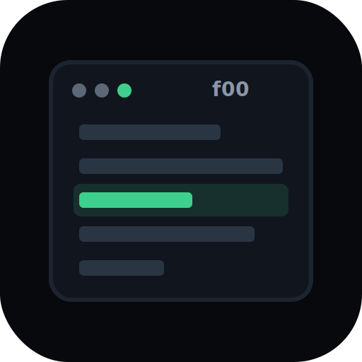

# f00

<p align="left">
  
</p>

[](https://github.com/theesfeld/f00/actions/workflows/ci.yml)
[](https://github.com/theesfeld/f00#license)
[](https://github.com/theesfeld/f00/releases)
[](https://crates.io/crates/f00)
[](https://f00.sh)

**f00** — a next-generation, cross-platform **coreutils `ls` clone** in Rust: modern UX by default, **exact GNU behavior under `--gnu`** for scripts, plus tree / JSON / icons / git.

**Website:** [https://f00.sh](https://f00.sh) · **Binary:** `f00` · **Latest:** v0.10.2

<!-- agents:status:begin -->
> **Status:** v0.10.2 exact GNU drop-in behavior (`--gnu`) + flag WHEN parity · Latest: `v0.10.2` · 0.x minors may include breaking changes
<!-- agents:status:end -->

---

## Install

```bash
curl -fsSL https://f00.sh/install.sh | bash
```

Installs to **`~/.local/bin`** by default (override with `INSTALL_DIR`). The installer adds that dir to your shell rc when it is missing from `PATH` (`ADD_PATH=0` to skip).

```bash
curl -fsSL https://f00.sh/install.sh | F00_VERSION=v0.7.1 bash
curl -fsSL https://f00.sh/install.sh | INSTALL_DIR=$HOME/bin bash
```

```bash
cargo install f00 --locked          # crates.io
brew install --formula ./Formula/f00.rb   # from a clone; needs Homebrew
```

**We never replace system `/bin/ls` by default.** The primary command is always `f00`.

### Using f00 as `ls`

Most people should keep typing **`f00`**. If you want muscle memory for `ls`, pick one opt-in path:

**1. Shell alias (recommended for interactive use)**

```bash
# modern product defaults (icons, git, …)
echo "alias ls='f00'" >> ~/.bashrc    # or ~/.zshrc
echo "alias ll='f00 -la'" >> ~/.bashrc

# coreutils-shaped (no icons/git; better for scripts / boring output)
# echo "alias ls='f00 --gnu'" >> ~/.bashrc
# or: export F00_GNU=1
```

Aliases only affect interactive shells. Non-interactive scripts keep using `/bin/ls` unless they call your alias-enabled shell.

**2. Optional PATH symlink (installer opt-in)**

```bash
curl -fsSL https://f00.sh/install.sh | F00_INSTALL_LS=1 bash
```

Creates `…/bin/ls` → `f00` next to the binary. Anything that finds `ls` on your `PATH` (before `/bin`) will run f00. Does **not** overwrite `/bin/ls`.

**3. Soft drop-in when the binary is named `ls`**

If you symlink or rename so argv0 is `ls`, f00 uses quieter defaults (icons/dirs-first off). Full strict mode still needs `--gnu` or `F00_GNU=1`.

More detail: [f00.sh#as-ls](https://f00.sh/#as-ls)

### Update

```bash
f00 --update          # or: f00 update
f00 --check-update    # or: f00 check-update  (exit 1 if behind)
```

---

## Features

| Area | Status | Notes |
|------|--------|--------|
| **GNU coreutils `ls`** | Shipped | Flag surface + **`--gnu` behavior parity** (CI tests vs system `ls`) |
| **Quoting** | Shipped | `-b` `-q` `-Q` `-N` `--quoting-style` + `QUOTING_STYLE` |
| **LS_COLORS** | Shipped | Via `lscolors` / env |
| **Speed** | Shipped | Parallel `stat` (rayon), cheap short path, uid cache, Linux `statx` + **io_uring** batch, `--threads`, `--profile` |
| **Portability** | Shipped | Linux, macOS, Windows, FreeBSD |
| **Git status** | Shipped | Default feature |
| **Icons** | Shipped | Nerd Font glyphs (eza-style special dirs + file types); `--icons[=auto\|always\|never]` (default: auto on TTY) |
| **JSON / CSV / TSV / tree** | Shipped | Machine formats |
| **TOML config** | Shipped | XDG / AppData |
| **Shell completions** | Shipped | `f00 --generate-completions SHELL` |
| **Man page** | Shipped | `f00 --generate-man` · committed `man/f00.1` |
| **TUI browser** | Shipped | `f00 --browse` — dual-pane FM, **syntax-colored preview**, sort, `$EDITOR`/`$PAGER` |
| **Archives** | Shipped | zip / tar / tar.gz as virtual dirs |
| **Ignore files** | Shipped | `--ignore-files` → `.gitignore` / `.f00ignore` |
| **Self-update** | Shipped | `--update` / `--check-update` via GitHub Releases |
| **Plugins** | Shipped (opt-in) | Feature `plugins` · ABI v1 · decorate hooks · #27 |

---

## Usage

```bash
# Classic listing
f00 -la

# Drop-in GNU shape (scripts)
f00 --gnu -lah /tmp
F00_GNU=1 f00 -la

# Quoting / NUL / version sort / width
f00 -bQ -1 .
f00 --zero -1 .
f00 -v -1 .
f00 -w 40 -C .

# Time styles / hide / hyperlink
f00 -l --time-style=long-iso
f00 --hide='*.o' -1
f00 --hyperlink=auto -1

# Machine output (rich metadata: inode, times, owner, permissions, …)
f00 --json
f00 -j                 # short for --json (not used by GNU ls)
f00 --csv
f00 --tsv

# Archives (auto when path is zip/tar)
f00 project.zip
f00 --archive=false project.zip   # treat as plain file

# Ignore files
f00 --ignore-files

# Interactive browser (dual-pane when wide enough)
f00 --browse
f00 --tui ~/src

# Icons (auto on TTY; force on/off) — needs a Nerd Font for glyphs
f00 -la --icons              # same as --icons=always
f00 -la --icons=auto
f00 -la --icons=never
f00 -la --icons=always --git
# Special dirs (Desktop/Downloads/Music/…) + file-type icons when icons on

# Speed / profiling
f00 --threads 0 -1 /large/dir   # parallel metadata (default; 0 = auto rayon)
f00 --threads 1 -1 /large/dir   # force serial stats
f00 --threads 8 -1 /large/dir   # fixed rayon pool size
f00 --profile -la /large/dir    # stderr: readdir_ms stat_ms sort_ms format_ms total_ms
f00 --io-uring=false -1 /large  # Linux: disable io_uring batch statx (default: on)
```

Large directories (**>32** entries) parallelize metadata collection with rayon. Sort order is unchanged. Benchmark:

```bash
# Comparative: GNU ls vs eza vs f00 (wall + CPU)
./scripts/bench-compare.sh           # synthetic 2000 files
./scripts/bench-compare.sh 5000
./scripts/bench-compare.sh --dir ~   # real directory
# Uses hyperfine when available; GNU time for user/sys CPU

./scripts/bench-list.sh              # f00-only sequential vs parallel + --profile
cargo bench -p f00-core --bench list_bench   # Criterion microbench
```

### Shell completions

```bash
# bash
f00 --generate-completions bash > ~/.local/share/bash-completion/completions/f00

# zsh (ensure fpath includes the directory)
f00 --generate-completions zsh > ~/.zsh/completions/_f00

# fish
f00 --generate-completions fish > ~/.config/fish/completions/f00.fish

# powershell / elvish
f00 --generate-completions powershell
f00 --generate-completions elvish
```

### Man page

```bash
# View generated man page
f00 --generate-man | man -l -

# Or install the committed page (packagers)
# man/f00.1  →  $(mandir)/man1/f00.1
# Regenerate after CLI changes:
./scripts/gen-man.sh
```

### TUI keys (`--browse`)

| Key | Action |
|-----|--------|
| `j`/`k` · arrows | Move (active pane) |
| Enter | Open dir / print file path & quit |
| `h`/`l` · Backspace | Parent / enter |
| `Tab` | Switch active pane |
| `\` / `\|` | Toggle dual-pane layout |
| `c` / `m` / `d` | Copy / move / delete (marked or cursor) → other pane; confirm overlay |
| Space | Mark · `y` print marks & quit (or confirm when overlay open) |
| `/` | Filter · `Esc` clear / cancel confirm |
| `s` / `S` | Cycle sort (name/size/mtime/ext) · reverse |
| `p` | Toggle preview pane (single-pane only) |
| `e` / `v` | Open in `$EDITOR` · view in `$PAGER` |
| `.` | Toggle hidden · `r` refresh · `H` help · `q` quit |

---

## GNU surface (highlights)

`-aA` `-l1Cmx` `-h` `--si` `-Rr` `-tSXvUf` `-d` `-Fp` `--file-type` `-BI` `--hide` `-LH` `-goGn` `-is` `-uc` `-vw` `-Z` `--zero` `-D` `--dired` `-bQNq` `--quoting-style` `--time-style` `--block-size` `--author` `--hyperlink` `--indicator-style` `--format` `--sort` `--time` `--group-directories-first` `--full-time` `--color` **`--gnu`**

Strict `--gnu` / `F00_GNU=1`: no icons/git decorations, classic sort, script-safe.

---

## Cargo features

| Feature | Default | Description |
|---------|---------|-------------|
| `git` | yes | Git status column |
| `archives` | yes | zip/tar listing |
| `tui` | yes | `--browse` / `--tui` |
| `io-uring` | yes | Linux batch metadata via io_uring (no-op off Linux) |
| `plugins` | no | Dynamic plugin host (`--list-plugins`) |

```bash
cargo build -p f00 --release
cargo build -p f00 --no-default-features   # minimal
cargo build -p f00 --features "git,archives,tui,io-uring,plugins"
```

---

## Configuration

Unix: `~/.config/f00/config.toml` (or `$F00_CONFIG` / `--config`)

```toml
[defaults]
all = false
long = false
human = true
icons = "auto"    # auto | always | never  (bool true/false also accepted)
color = "auto"
git = true
dirs_first = true
```

---

## Crates

| Crate | Role |
|-------|------|
| `f00-core` | readdir, sort, filter, ignore files |
| `f00-format` | long/columns/tree/json/csv, quoting, colors |
| `f00-compat` | GNU helpers |
| `f00-git` | git status |
| `f00-archive` | zip/tar virtual listing |
| `f00-tui` | interactive browser |
| `f00-plugin` | plugin host ABI |
| `f00-plugin-hello` | example cdylib plugin |
| `f00` (path `crates/f00-cli`) | binary `f00` (crates.io) |

---

## Building from source

```bash
git clone https://github.com/theesfeld/f00
cd f00
cargo build --release -p f00
./target/release/f00 --version
```

---

## Comparison

| | GNU `ls` | eza | lsd | **f00** |
|--|----------|-----|-----|---------|
| Language | C | Rust | Rust | Rust |
| Full coreutils flags | Native | Partial | Partial | **Shipped** (+ `--gnu`) |
| Icons / git | No | Yes | Yes | Yes |
| TUI | No | No | No | **Yes** |
| Archives | No | No | No | **Yes** |
| Windows | Weak | Strong | Strong | First-class |

---

## License

MIT OR Apache-2.0

## Links

- Issues: https://github.com/theesfeld/f00/issues  
- Design: `docs/superpowers/specs/2026-07-16-f00-design.md`  
- Sync: `docs/SYNC.md`
